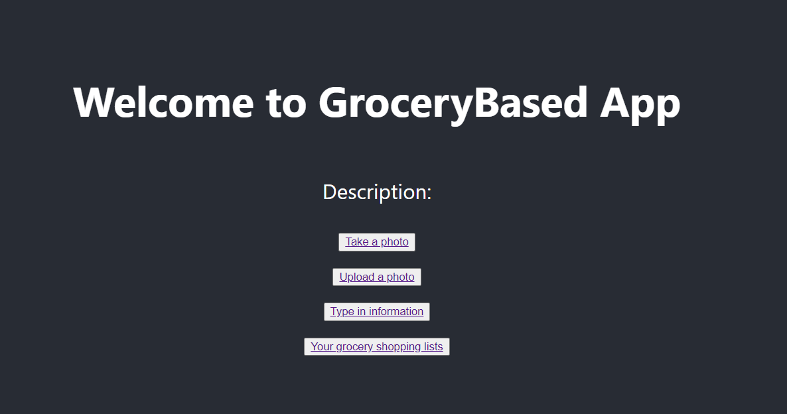

# htn-proj
Hack the north project.
Web-based application made by using ReactJS, Python/Flask, Google Vision API.
Detect uploaded images label or provide input to return items name.
To test project:
Clone the project
Go to flaskbackend folder: pip install -r requirement.txt
Set up vision API by follow this doc: https://cloud.google.com/vision/docs/setup#windows
ADD the generated KEY json file in flaskbackend folder

Read text from image: https://www.geeksforgeeks.org/text-detection-and-extraction-using-opencv-and-ocr/

